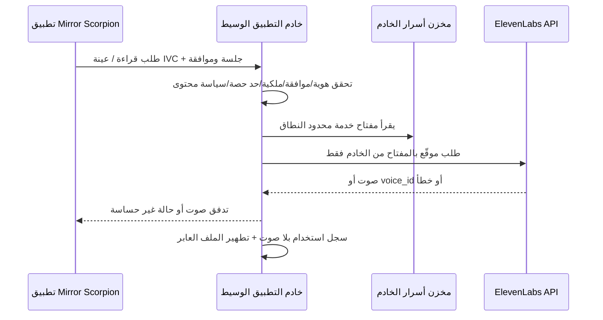

# تصميم الخادم الوسيط وحدود الاستخدام لـElevenLabs

> **الحالة:** تصميم تقني غير منشور. لا توجد دالة حية أو API key أو إعداد فوترة. هذا المستند يمنع المسار غير الآمن: `Flutter APK → ElevenLabs` مباشرة.

## سبب وجود خادم وسيط

لا يجوز وضع مفتاح ElevenLabs في تطبيق Android، لأنه سرّ يسمح باستخدام الرصيد ويجب ألا يظهر في كود العميل. توصي وثائق ElevenLabs بحساب خدمة للمسارات الإنتاجية، ومفتاح محدود النطاق والحصة، وفرض أذونات على مستوى المورد في خادم التطبيق نفسه. [1] [2] لذلك يتحقق الخادم من كل طلب ثم يتصل هو بالمزود، بدلاً من أن يتصل APK بالمزود مباشرة.

## بدائل الاستضافة التي ينبغي للمالك اختيار واحد منها

| النهج | ما يقدمه للمستخدم | التكلفة والبنية | تعقيد الإعداد |
|---|---|---|---|
| **توسعة خادم Firebase الموجود** | التطبيق يتصل بدوال HTTPS ضمن مشروع `mirorr-d11b2`؛ تتولى الأسرار والحدود والحذف. مناسب لأن التطبيق يستعمل Firebase فعلاً. | تكلفة ElevenLabs مستقلة، وقد تتطلب الوظائف/التخزين/السجلات فوترة سحابية عند تجاوز الحصة أو لتفعيل الموارد المطلوبة. لا نفعّلها قبل اعتمادها. | متوسط؛ يوجد مشروع لكن النشر مؤجل عمداً. |
| **خادم API مستقل صغير** | خدمة واحدة للصوت قابلة للنقل بين ElevenLabs ومزود آخر دون ربطها بخدمات التطبيق الأخرى. | تكلفة استضافة وخزن أسرار مستقلة إضافة إلى ElevenLabs؛ تحتاج مراقبة وتحديثات أمنية. | أعلى؛ يحتاج استضافة، اسم نطاق، سجل أعطال وحماية من إساءة الاستخدام. |
| **أصوات Android المحلية فقط** | قراءة فورية حيث تتوفر أصوات الجهاز، بلا حساب خارجي أو إرسال نص. | لا فاتورة مزود ولا خادم. | منخفض؛ متاح الآن، لكنه لا يقدم نسخ صوت. |

لا يبدأ التنفيذ قبل اختيار نهج واحد وسقف شهري وخطة ElevenLabs. هذه ليست ثلاثة إصدارات متنافسة للتطبيق؛ هي بدائل بنية لتقديم نفس الخدمة بأمان.

## نموذج الصلاحيات والبيانات

يستخدم الخادم معرّف تثبيت مستعاراً أو حساب المستخدم عند توفر تسجيل دخول، ولا يستمد هوية من اسم الصوت. كل صوت مخصص يرتبط بصاحبه من خلال جدول أذونات صريح. لا يملك المستخدم حق الوصول إلى صوت بمجرد تخمين `voice_id`.

| سجل | حقول الحد الأدنى | الغرض |
|---|---|---|
| `voice_profiles` | `profileId`، `ownerId`، `provider`، `providerVoiceId`، `mode`، `status`، `createdAt`، `deletedAt` | فصل هوية التطبيق عن معرّف المزود والتحكم في الإزالة. |
| `voice_consents` | `consentId`، `ownerId`، `consentVersion`، `purpose`، `audioSha256`، `acceptedAt`، `revokedAt` | إثبات أن المستخدم اختار المسار وقبل استخدام صوته؛ بلا حفظ الملف الصوتي. |
| `usage_ledger` | `requestId`، `ownerId`، `operation`، `characters`، `estimatedCostBand`، `result`، `createdAt` | إنفاذ حصة يومية/شهرية ومراجعة الاستهلاك من دون نسخ نص أو صوت. |
| `delete_requests` | `requestId`، `profileId`، `providerDeleteStatus`، `attempts`، `completedAt` | يجعل حذف IVC قابلاً للمتابعة ولا يدّعي النجاح قبل استجابة المزود. |

توصي وثائق ElevenLabs بربط المستخدمين بالأصوات في سجل موارد وأذونات على مستوى المورد، وهو أساس هذا النموذج. [2]

## واجهات HTTP المقترحة

تظل أسماء المسارات وأشكال الاستجابة داخلية إلى أن يعتمد المالك الاستضافة، لكن العقد التالي يحدد الحدود الوظيفية اللازمة للاختبار.

| الواجهة | المدخلات المقبولة | التحقق قبل الاتصال الخارجي | الناتج |
|---|---|---|---|
| `POST /v1/voice/tts` | نص مختار، `profileId` اختياري، لغة، معرف طلب | الحجم، سياسة محتوى، ملكية الصوت إن وجد، المتبقي من الحصة، حد المعدل. | صوت متدفق أو رمز خطأ مفهوم. |
| `POST /v1/voice/ivc/consents` | إصدار الموافقة، الغرض، تأكيد العمر والحق | لا يقبل `true` صامتاً؛ يصدر `consentId` قصير العمر. | حالة الموافقة فقط. |
| `POST /v1/voice/ivc` | `consentId` صالح وعينة صوت أحادية المتحدث | صيغة/حجم/مدة، SHA-256، تطابق صاحب الموافقة، منع تكرار الطلب وحد الحصة. | `profileId` وحالة `creating`؛ لا يعيد عينة الصوت. |
| `GET /v1/voice/profiles` | جلسة المالك | يعيد أصوات المالك وحده وحالاتها. | قائمة مصغرة لا تشمل العينات. |
| `DELETE /v1/voice/profiles/{profileId}` | جلسة المالك، تأكيد حذف | يتحقق من المالك ثم يوقف الاستعمال ويبدأ حذف ElevenLabs. | `deleting` ثم `deleted` أو `failed`. |
| `GET /v1/voice/usage` | جلسة المالك | يحد من الاستعلام إلى المالك. | المتبقي والحالة دون أسرار أو فاتورة مفصلة. |

لا يسمح الخادم بطلب PVC من التطبيق. لأن PVC يتطلب تحقق المالك ولا يمكن حذف PVC غير الموثّق مباشرة وفق وثائق ElevenLabs، يبقى هذا المسار خارج المنتج المحمول. [3] [4]

## حدود الاستخدام المقترحة

تضبط القيم النهائية بعد اختيار الخطة؛ إلى ذلك الحين هذه حواجز وليست وعود تسعير:

| الحاجز | قاعدة التطبيق | أثرها |
|---|---|---|
| سقف شهري عام | رقم يختاره المالك ويوقف كل الطلبات بعده. | يمنع زيادة غير متوقعة من الاستخدام. |
| حصة لكل تثبيت/حساب | رصيد يومي ومعدل طلبات أقصى، منفصل للقراءة ولإنشاء IVC. | يمنع استنزاف الرصيد أو إساءة الاستخدام. |
| حد طول النص | حد محافظ يتفق مع حد النموذج، مع تقسيم مُراقَب للنصوص الطويلة. | يجعل الكلفة متوقعة ويمنع إدخال كتب كاملة دفعة واحدة. |
| أصوات مخصصة | المالك فقط، ولا يسمح بالمشاركة العامة أو التصدير أو الـVoice Library. | يقلل الانتحال وانتشار الصوت. |
| إساءة/فشل | خطأ موحد، تجميد محدود، ومسار دعم؛ لا يعاد إرسال عينة تلقائياً. | يحمي الخصوصية والرصيد. |

ينشأ مفتاح خدمة منفصل لبيئة الاختبار والإنتاج، ويقيد بالمنافذ اللازمة وحصة ائتمانية وعنوان IP إذا كان الخادم يملك عنواناً ثابتاً. مفتاح المستخدم قصير العمر مناسب للتطوير فقط، ولا يوضع في CI أو التطبيق. [1] [2]

## اختبارات القبول قبل النشر

لا تعتمد ميزة الصوت السحابي إلا إذا نجحت الاختبارات التالية في CI وAPK حقيقي: رفض النص بلا موافقة/جلسة، رفض `profileId` لمستخدم آخر، وقف الطلب عند الحصة، إنشاء IVC فقط بعد `consentId` صحيح، حذف محلي وخارجي قابل للتحقق، فشل صادق عند انقطاع الشبكة، وعدم ظهور مفتاح ElevenLabs في APK أو Git أو logs. وبعد ذلك يختبر المالك اختيار الصوت، القراءة، الإيقاف، والحذف على جهاز Android.

## المراجع

[1]: https://elevenlabs.io/docs/overview/administration/workspaces/api-keys "ElevenLabs API Keys"
[2]: https://elevenlabs.io/docs/eleven-api/guides/how-to/best-practices/security "ElevenLabs Secure by Design"
[3]: https://elevenlabs.io/docs/eleven-creative/voices/voice-cloning "ElevenLabs Voice Cloning overview"
[4]: https://help.elevenlabs.io/hc/en-us/articles/26943561261073-How-do-I-delete-voices-from-My-Voices "ElevenLabs Help: deleting voices"
